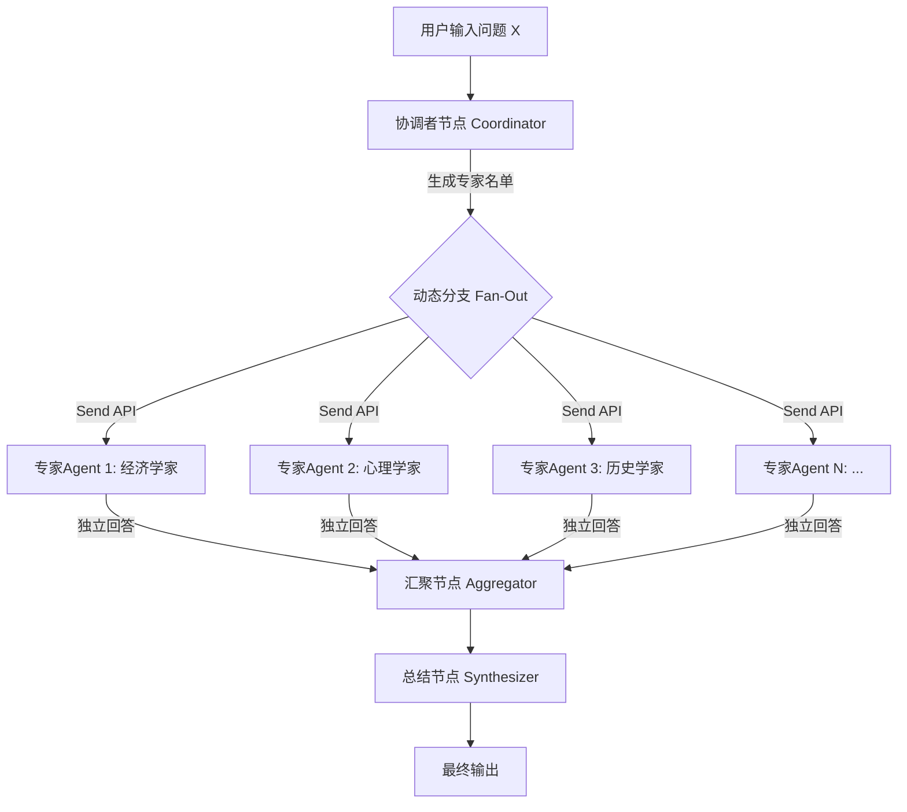

# AI 智囊团 — 详细实施方案

> 基于 LangGraph 的动态多代理决策系统 · 群聊交互模式

---

## 一、项目概览

### 1.1 核心理念

用户输入任意问题 X，系统自动完成以下流程：

1. **智能选人** — 分析问题本质，推荐最适合探讨该问题的专家角色
2. **角色赋能** — 为每位专家生成独立的人格设定（身份、背景、思维方式）
3. **并行思考** — 所有专家同时独立思考，基于各自角色给出答案
4. **观点汇聚** — 收集所有专家观点，综合分析、输出结论

**前端以"群聊"的形式展现整个过程**：每位专家是群里的一个用户，他们的观点是群里的聊天消息。

### 1.2 技术选型

| 层级 | 技术 | 选择理由 |
|------|------|----------|
| Agent 编排 | **LangGraph** | 工业级状态机架构，支持 Map-Reduce 并行分支，企业认可度高 |
| LLM 调用 | **OpenAI / Claude API** | 主流大模型，支持 Structured Output（结构化输出） |
| 后端 API | **FastAPI** | 异步高性能，原生支持 SSE 流式输出 |
| 前端界面 | **React + Vite** | 组件化开发，声明式渲染群聊消息列表，useReducer 管理消息状态 |
| 数据格式 | **Pydantic** | 类型安全的数据校验，用于定义专家角色和回复的结构 |

---

## 二、系统架构

### 2.1 整体工作流（StateGraph）



### 2.2 四大核心节点详解

---

#### 节点 1：协调者 (Coordinator Node)

**职责**：分析问题，决定需要哪些领域的专家。

**输入**：用户的原始问题 X

**输出**：一个结构化的专家列表（JSON）

**Prompt 设计思路**：

```
你是一位跨学科研究顾问。用户将向你提出一个问题，你需要分析这个问题
涉及的维度，并推荐 3-6 位最适合探讨该问题的专家角色。

要求：
1. 覆盖不同视角（技术、人文、商业、伦理等）
2. 角色之间应有"张力"，观点可能互补甚至冲突
3. 为每位专家提供：角色名称、专业领域、思维风格、关注的核心维度

请以 JSON 格式输出：
[
  {
    "name": "角色名称，如'资深经济学家'",
    "domain": "专业领域",
    "thinking_style": "思维风格描述",
    "focus": "该角色关注问题的哪个维度",
    "avatar_emoji": "一个最能代表该角色的 Emoji 表情，用作群聊头像",
    "system_prompt": "完整的角色设定提示词，用第二人称'你'来描述"
  }
]
```

**示例输出**（假设问题是"AI会取代程序员吗？"）：

```json
[
  {
    "name": "资深软件架构师",
    "domain": "软件工程",
    "thinking_style": "务实、注重工程细节、从实际开发经验出发",
    "focus": "AI 在代码生成和工程实践中的真实能力边界",
    "avatar_emoji": "🏗️",
    "system_prompt": "你是一位有20年经验的资深软件架构师..."
  },
  {
    "name": "劳动经济学家",
    "domain": "劳动力市场",
    "thinking_style": "数据驱动、历史对比、关注宏观趋势",
    "focus": "技术革命对就业结构的历史性影响",
    "avatar_emoji": "📊",
    "system_prompt": "你是一位专注于技术变革与就业关系的劳动经济学家..."
  },
  {
    "name": "AI 伦理研究员",
    "domain": "科技伦理",
    "thinking_style": "批判性思维、关注长期社会影响",
    "focus": "AI 替代人类劳动的伦理和社会公平问题",
    "avatar_emoji": "⚖️",
    "system_prompt": "你是一位麻省理工学院的AI伦理研究员..."
  }
]
```

---

#### 节点 2：专家思考 (Expert Node) — 并行执行

**职责**：每位专家基于自己的角色身份，独立思考并回答问题。

**关键机制**：使用 LangGraph 的 **`Send` API** 实现动态 Fan-Out（扇出）。协调者节点生成 N 个专家，就自动产生 N 个并行分支，每个分支独立调用 LLM。

**输入**：
- 角色设定（来自协调者生成的 `system_prompt`）
- 用户的原始问题 X

**Prompt 设计思路**：

```
System Message（动态生成）:
{expert.system_prompt}

你正在一个群聊讨论中发言。请基于你的专业角色身份，对以下问题给出你的分析和观点。
要求：
1. 用对话式的、自然的语气表达（像在群里发言，而不是写论文）
2. 从你的专业角度深入分析，但表达要通俗易懂
3. 提供具体的论据和案例
4. 明确表达你的立场和结论

User Message:
{用户的问题 X}
```

**输出结构**：

```json
{
  "expert_name": "资深软件架构师",
  "avatar_emoji": "🏗️",
  "message": "群聊中的发言内容，用自然的对话语气，篇幅适中",
  "key_points": ["要点1", "要点2", "要点3"],
  "conclusion": "一句话核心结论",
  "confidence": 0.85
}
```

---

#### 节点 3：汇聚器 (Aggregator Node)

**职责**：收集所有并行分支的结果。

这是 LangGraph Map-Reduce 模式中的 **Reduce** 步骤。当所有 `Send` 出去的分支都完成后，
系统自动将所有分支的结果汇入这个节点。

**核心逻辑**：
- 不做任何 LLM 调用，纯粹是数据收集
- 将所有专家的回答组装成一个完整的列表
- 传递给下一个节点（总结者）

---

#### 节点 4：总结者 (Synthesizer Node)

**职责**：综合所有专家观点，生成最终的全局分析报告。

**输入**：所有专家的回答列表

**Prompt 设计思路**：

```
你是一位高级分析师，负责综合以下多位专家对同一问题的独立分析。
你的输出将作为群聊中的一条"总结卡片"展示。

原始问题：{问题 X}

各专家观点：
{所有专家回答的格式化列表}

请完成以下任务：
1. 【共识提炼】找出专家们观点的共同之处
2. 【分歧分析】指出观点冲突的地方，分析冲突的原因
3. 【盲点发现】指出所有专家可能都忽略的角度
4. 【综合结论】给出你的综合性结论和建议
```

---

## 三、数据流与状态管理

### 3.1 全局状态定义 (TypedDict)

```
ThinkTankState:
├── question: str                    # 用户原始问题
├── experts: List[ExpertProfile]     # 协调者生成的专家列表
├── expert_responses: List[ExpertResponse]  # 所有专家的回答（Reduce 汇聚）
└── final_report: str                # 最终综合报告
```

### 3.2 状态流转过程

```
步骤1: 用户输入
  State = { question: "AI会取代程序员吗？", experts: [], expert_responses: [], final_report: "" }

步骤2: 协调者节点执行完毕
  State = { question: "...", experts: [经济学家, 架构师, 伦理学家], ... }

步骤3: Send API 触发 → 3个并行分支同时执行

步骤4: 3个分支全部完成 → Reduce 汇聚
  State = { ..., expert_responses: [回答1, 回答2, 回答3], ... }

步骤5: 总结者节点执行完毕
  State = { ..., final_report: "综合分析报告..." }
```

---

## 四、API 层设计 (FastAPI)

### 4.1 接口设计

| 端点 | 方法 | 功能 | 返回方式 |
|------|------|------|----------|
| `/api/think` | POST | 提交问题，启动智囊团分析 | SSE 流式返回 |
| `/api/history` | GET | 获取历史讨论记录 | JSON |

### 4.2 SSE 流式输出事件序列（群聊消息协议）

用户提交问题后，前端通过 SSE（Server-Sent Events）实时接收以下事件流。
每个事件被前端渲染为群聊中的一条消息：

```
// —— 阶段1：系统通知（群聊中的灰色居中提示） ——
event: system_notice
data: {"message": "🤖 AI 智囊团正在为您召集专家..."}

// —— 阶段2：专家入群通知（逐个弹出，像群聊"XXX 加入了群聊"） ——
event: expert_join
data: {"name": "资深软件架构师", "domain": "软件工程", "avatar_emoji": "🏗️"}

event: expert_join
data: {"name": "劳动经济学家", "domain": "劳动力市场", "avatar_emoji": "📊"}

event: expert_join
data: {"name": "AI 伦理研究员", "domain": "科技伦理", "avatar_emoji": "⚖️"}

event: system_notice
data: {"message": "专家已就位，开始讨论..."}

// —— 阶段3：用户的问题展示（右侧气泡，代表"你"发的消息） ——
event: user_message
data: {"message": "AI会取代程序员吗？"}

// —— 阶段4：专家正在输入（显示"XXX 正在输入..."动画） ——
event: expert_typing
data: {"name": "资深软件架构师", "avatar_emoji": "🏗️"}

event: expert_typing
data: {"name": "劳动经济学家", "avatar_emoji": "📊"}

// —— 阶段5：专家发言（左侧气泡，逐条出现，谁先完成谁先出现） ——
event: expert_message
data: {
  "name": "资深软件架构师",
  "avatar_emoji": "🏗️",
  "message": "从我20年的工程经验来看...",
  "key_points": ["要点1", "要点2"],
  "conclusion": "核心结论...",
  "confidence": 0.85
}

event: expert_message
data: {
  "name": "劳动经济学家",
  "avatar_emoji": "📊",
  "message": "如果我们看历史数据...",
  "key_points": ["要点1", "要点2"],
  "conclusion": "核心结论...",
  "confidence": 0.7
}

// —— 阶段6：总结者发言（特殊样式的气泡，或置顶公告卡片） ——
event: system_notice
data: {"message": "📋 AI 分析师正在综合所有观点..."}

event: summary_message
data: {
  "consensus": "共识内容...",
  "disagreements": "分歧内容...",
  "blind_spots": "盲点内容...",
  "conclusion": "综合结论..."
}

event: done
data: {}
```

---

## 五、前端界面设计 — 群聊模式

### 5.1 整体布局

界面模拟一个现代即时通讯应用（如微信群聊 / Slack Channel），核心分为三个区域：

```
+---------------------------------------------------+
|  群聊标题栏                                         |
|  "AI 智囊团" · 在线 5 人                             |
+---------------------------------------------------+
|                                                     |
|  +-------------------------------+                  |
|  | 🤖 AI 智囊团正在为您召集专家... |  <-- 系统通知    |
|  +-------------------------------+                  |
|                                                     |
|  -- 🏗️ 资深软件架构师 加入了讨论 --    <-- 入群提示   |
|  -- 📊 劳动经济学家 加入了讨论 --                     |
|  -- ⚖️ AI 伦理研究员 加入了讨论 --                    |
|                                                     |
|                      +--------------------+         |
|                      | AI会取代程序员吗？  | 🧑      |
|                      +--------------------+         |
|                                        <-- 用户消息  |
|                                                     |
|  🏗️ 资深软件架构师                                   |
|  +--------------------------------------+           |
|  | 从我20年的工程经验来看，AI 目前擅长     |           |
|  | 的是模式化的代码生成，但在架构决策、    |           |
|  | 需求理解、系统权衡等方面还远远不够...   |           |
|  |                                      |           |
|  | 📌 核心观点：                         |           |
|  | · AI 是极强的"副驾驶"，但不是"驾驶员"  |           |
|  | · 真正被替代的是不愿学习的程序员       |           |
|  +--------------------------------------+           |
|                                       <-- 专家消息   |
|                                                     |
|  📊 劳动经济学家 正在输入...           <-- 输入状态   |
|                                                     |
|  ...（更多专家消息）...                               |
|                                                     |
|  +--------------------------------------+           |
|  | 📋 综合分析报告                       |           |
|  | ----------------------------------   |           |
|  | ✅ 共识：...                          |           |
|  | ⚡ 分歧：...                          |           |
|  | 🔍 盲点：...                          |           |
|  | 📝 结论：...                          |           |
|  +--------------------------------------+           |
|                                 <-- 置顶总结卡片     |
+---------------------------------------------------+
|  💬 请输入你的问题...                      [发送]    |
+---------------------------------------------------+
```

### 5.2 群聊消息类型

| 消息类型 | 位置/样式 | 触发时机 |
|----------|-----------|----------|
| **系统通知** | 居中灰色小字，无气泡 | 召集专家、讨论开始、综合分析中 |
| **入群提示** | 居中分割线样式 | 每位专家被协调者选中时 |
| **用户消息** | 右侧气泡 + 用户头像 | 用户提出问题时 |
| **正在输入** | 左下角 "XXX 正在输入..." 跳动动画 | 专家 LLM 调用中（并行时多个同时显示） |
| **专家消息** | 左侧气泡 + Emoji 头像 + 角色名 | 专家完成回答时（谁先完成谁先出现） |
| **总结卡片** | 特殊样式卡片（渐变边框 + 图标分区） | 总结者完成分析时 |

### 5.3 群聊交互时间线（用户体验流程）

```
时间 ───────────────────────────────────────────────────────────>

[0s]  用户输入问题，点击发送
      └─ 右侧出现用户消息气泡

[1s]  系统通知："🤖 AI 智囊团正在为您召集专家..."
      └─ 居中灰色提示

[3s]  协调者完成 --> 专家依次"入群"
      └─ "🏗️ 资深软件架构师 加入了讨论"  (弹入动画，间隔 0.5s)
      └─ "📊 劳动经济学家 加入了讨论"
      └─ "⚖️ AI 伦理研究员 加入了讨论"

[4s]  系统通知："专家已就位，开始讨论..."
      └─ 同时显示多个 "XXX 正在输入..." 动画（模拟并行思考）

[6~12s] 专家消息逐条出现（谁的 LLM 先返回，谁的气泡先弹出）
        └─ 每条消息有滑入动画
        └─ 消息内含：正文 + "📌 核心观点" 折叠区

[13s] 系统通知："📋 AI 分析师正在综合所有观点..."

[16s] 总结卡片滑入（特殊样式，带渐变边框）
      └─ 分区展示：共识 / 分歧 / 盲点 / 结论

[完成] 输入框重新激活，用户可以继续提问（开始新一轮讨论）
```

### 5.4 视觉风格

- **深色主题** + 玻璃拟态（Glassmorphism）聊天气泡
- **Emoji 头像**：每位专家用一个代表性 Emoji 作为头像（由协调者 LLM 生成）
- **气泡配色**：不同专家的气泡有微妙的色彩差异（基于角色领域自动分配色调）
- **"正在输入" 动画**：三个跳动的圆点（...），并行思考时多行同时跳动，视觉冲击力强
- **消息出现动画**：气泡从下方滑入 + 轻微弹性回弹（ease-out-back）
- **总结卡片**：渐变边框 + 毛玻璃背景，与普通气泡明显区分
- **自动滚动**：新消息出现时聊天区域自动平滑滚动到底部

### 5.6 React 组件拆分

```
<App>
├── <ChatWindow>                      # 群聊主容器
│   ├── <ChatHeader>                  # 标题栏："AI 智囊团" · 在线 N 人
│   ├── <MessageList>                 # 消息列表区（自动滚动）
│   │   ├── <SystemNotice>            # 系统通知（居中灰色提示）
│   │   ├── <JoinNotice>              # 入群提示（"XXX 加入了讨论"）
│   │   ├── <UserMessage>             # 用户消息（右侧气泡）
│   │   ├── <ExpertMessage>           # 专家消息（左侧气泡 + Emoji头像 + 核心观点折叠区）
│   │   ├── <TypingIndicator>         # "正在输入..." 动画（支持多个同时显示）
│   │   └── <SummaryCard>             # 总结卡片（渐变边框特殊样式）
│   └── <MessageInput>               # 底部输入框 + 发送按钮
└── <Sidebar>                         # 侧边栏（可选，展示群成员状态）
    ├── <MemberList>                  # 成员列表（头像 + 状态：已发言/思考中）
    └── <TopicInfo>                   # 当前讨论主题
```

**核心状态管理（useReducer）**：

```
chatState = {
  messages: [],          // 所有消息（系统通知、入群、用户消息、专家消息、总结）
  experts: [],           // 当前群内的专家列表
  typingExperts: [],     // 正在输入的专家（用于显示 typing 动画）
  isThinking: false,     // 系统是否正在处理中（控制输入框禁用状态）
}

// Action 类型对应 SSE 事件
ACTION_TYPES = {
  ADD_SYSTEM_NOTICE,     // <- event: system_notice
  ADD_EXPERT,            // <- event: expert_join
  ADD_USER_MESSAGE,      // <- event: user_message
  SET_TYPING,            // <- event: expert_typing
  ADD_EXPERT_MESSAGE,    // <- event: expert_message（同时从 typingExperts 中移除）
  ADD_SUMMARY,           // <- event: summary_message
  SET_DONE,              // <- event: done
}
```

### 5.5 群聊侧边栏（可选）

群聊右侧可以展开一个侧边栏，展示当前讨论的元信息：

```
+----------------+
| 群聊成员 (5)    |
|----------------|
| 🧑 你          |
| 🏗️ 软件架构师  | ● 已发言
| 📊 经济学家    | ● 已发言
| ⚖️ 伦理研究员  | ◌ 思考中...
| 🧬 未来学家    | ◌ 思考中...
|----------------|
| 📋 讨论主题    |
| "AI会取代..."  |
+----------------+
```

---

## 六、项目文件结构

```
ai-think-tank/
├── README.md                     # 项目说明文档
├── .env.example                  # 环境变量模板（API Key 等）
│
├── backend/
│   ├── pyproject.toml            # Python 项目配置
│   ├── main.py                   # FastAPI 入口，定义 API 路由
│   ├── config.py                 # 配置管理（读取 .env）
│   │
│   ├── graph/                    # LangGraph 核心逻辑
│   │   ├── __init__.py
│   │   ├── state.py              # 全局 State 定义（TypedDict）
│   │   ├── nodes/
│   │   │   ├── __init__.py
│   │   │   ├── coordinator.py    # 协调者节点：分析问题、生成专家名单
│   │   │   ├── expert.py         # 专家节点：基于角色独立回答（Send 分支）
│   │   │   └── synthesizer.py    # 总结者节点：综合所有观点
│   │   └── builder.py            # 构建 StateGraph，连接节点和边
│   │
│   ├── models/                   # Pydantic 数据模型
│   │   ├── __init__.py
│   │   ├── expert.py             # ExpertProfile, ExpertResponse 等
│   │   └── api.py                # API 请求/响应模型
│   │
│   └── prompts/                  # 提示词模板
│       ├── coordinator.txt       # 协调者的 Prompt
│       ├── expert.txt            # 专家的 Prompt 模板
│       └── synthesizer.txt       # 总结者的 Prompt
│
├── frontend/                     # React + Vite 群聊式前端
│   ├── package.json
│   ├── vite.config.js
│   ├── index.html
│   └── src/
│       ├── main.jsx              # React 入口
│       ├── App.jsx               # 根组件
│       ├── App.css               # 全局样式（深色主题 + Glassmorphism）
│       │
│       ├── hooks/
│       │   ├── useChatReducer.js  # 群聊状态管理（useReducer）
│       │   └── useSSE.js          # SSE 连接与事件分发
│       │
│       └── components/
│           ├── ChatWindow.jsx     # 群聊主容器
│           ├── ChatHeader.jsx     # 标题栏
│           ├── MessageList.jsx    # 消息列表（自动滚动）
│           ├── MessageInput.jsx   # 输入框 + 发送按钮
│           ├── Sidebar.jsx        # 侧边栏（成员列表 + 主题）
│           │
│           └── messages/          # 各类消息组件
│               ├── SystemNotice.jsx    # 系统通知
│               ├── JoinNotice.jsx      # 入群提示
│               ├── UserMessage.jsx     # 用户消息气泡
│               ├── ExpertMessage.jsx   # 专家消息气泡
│               ├── TypingIndicator.jsx # "正在输入..." 动画
│               └── SummaryCard.jsx     # 总结卡片
│
└── tests/                        # 测试
    ├── test_coordinator.py
    ├── test_expert.py
    └── test_graph.py
```

---

## 七、核心技术亮点（简历可写）

| 亮点 | 说明 |
|------|------|
| **LangGraph StateGraph** | 使用有限状态机架构管理复杂的多代理工作流 |
| **动态 Map-Reduce** | 通过 `Send` API 实现运行时动态创建并行分支，专家数量由 LLM 自主决定 |
| **Structured Output** | 使用 Pydantic + LLM 的 JSON Mode 保证输出格式可靠 |
| **SSE 流式输出** | 使用 Server-Sent Events 实现实时的群聊消息推送 |
| **群聊交互范式** | 将多代理系统的推理过程以群聊对话的形式可视化，降低认知门槛 |
| **React 组件化** | 使用 useReducer 管理群聊消息状态，SSE 事件与 Action 一一映射，架构清晰 |
| **Prompt 工程** | 精心设计的多层提示词体系（协调者 → 专家 → 总结者） |
| **类型安全** | 全链路 Pydantic 类型校验，从 API 输入到 LLM 输出 |

---

## 八、后续可扩展方向

1. **专家辩论模式**：让专家看到彼此的观点后再进行第二轮回复（群里 @回复，图中增加循环边）
2. **工具增强**：给特定角色配备工具（如搜索引擎、计算器、代码执行器）
3. **用户干预**：允许用户在专家名单生成后手动增减角色（群管理功能：踢人 / 邀请）
4. **记忆系统**：多次提问后系统记住用户的偏好和讨论历史
5. **多模型混用**：根据角色特点选用不同的 LLM（如逻辑推理用 Claude，创意发散用 GPT-4）
6. **消息引用**：总结卡片中可以引用某位专家的原话，点击跳转到对应消息
